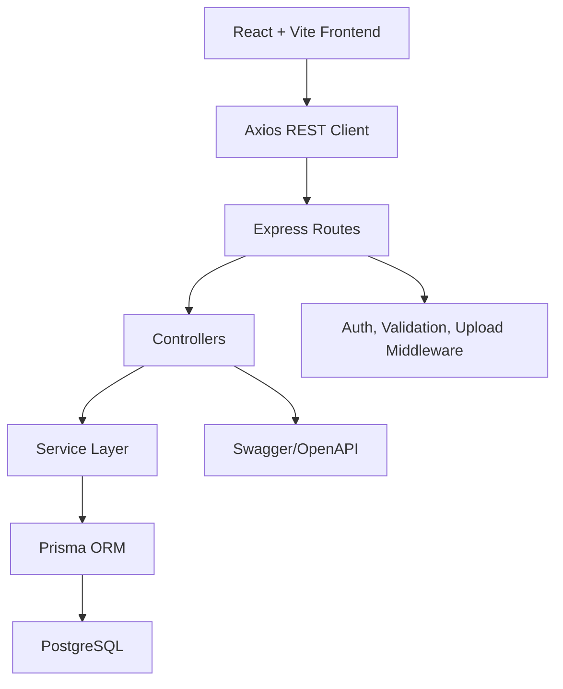
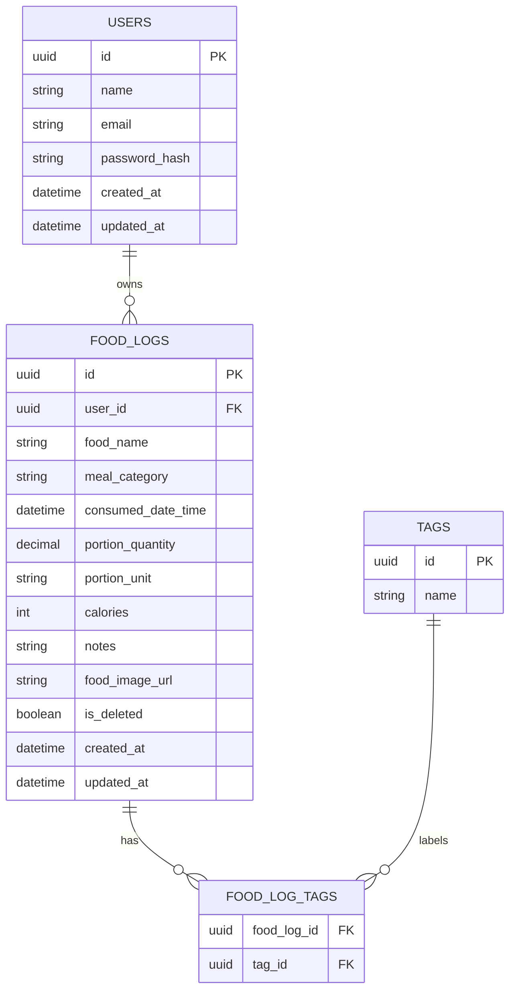

# Health Ledger

Health Ledger is a production-ready full-stack MVP for personal food logging, calorie analytics, and rule-based dashboard insights. Epic 1, Food Logging, is implemented end to end with JWT authentication, CRUD/search/filter/sort, tags, optional image uploads, analytics, Swagger docs, Docker, and starter tests.

## Stack

- Frontend: React, Vite, TypeScript, Tailwind CSS, React Router, React Hook Form, Axios, Recharts
- Backend: Node.js, Express, TypeScript, JWT, Prisma, Multer, Express Validator, Swagger
- Database: PostgreSQL
- DevOps: Docker, Docker Compose, ESLint, Prettier

## Local Development

1. Start PostgreSQL locally or with Docker.
2. Copy environment files:

```bash
cp backend/.env.example backend/.env
cp frontend/.env.example frontend/.env
```

3. Install and initialize the backend:

```bash
cd backend
npm install
npm run prisma:generate
npm run prisma:migrate
npm run prisma:seed
npm run dev
```

4. Install and run the frontend:

```bash
cd frontend
npm install
npm run dev
```

Frontend runs at `http://localhost:5173`, backend at `http://localhost:4000`, and Swagger docs at `http://localhost:4000/api/docs`.

## Docker

```bash
docker compose up --build
```

The compose stack starts `postgres`, `backend`, and `frontend`. Run the seed after the first migration if you want sample data:

```bash
docker compose exec backend npx prisma db seed
```

## Environment Variables

Backend:

- `DATABASE_URL`: PostgreSQL connection string
- `JWT_SECRET`: JWT signing secret
- `JWT_EXPIRES_IN`: token lifetime
- `PORT`: API port
- `FRONTEND_URL`: allowed CORS origin
- `UPLOAD_DIR`: food image upload folder

Frontend:

- `VITE_API_URL`: REST API base URL, for example `http://localhost:4000/api`

## API Surface

- `POST /api/auth/register`
- `POST /api/auth/login`
- `POST /api/auth/logout`
- `GET /api/auth/profile`
- `POST /api/foodlogs`
- `GET /api/foodlogs`
- `GET /api/foodlogs/:id`
- `PUT /api/foodlogs/:id`
- `DELETE /api/foodlogs/:id`
- `GET /api/foodlogs/search`
- `GET /api/analytics/dashboard`
- `GET /api/analytics/weekly-calories`
- `GET /api/analytics/monthly-calories`
- `GET /api/analytics/lowest-calorie-day`
- `GET /api/analytics/lowest-calorie-week`
- `GET /api/analytics/meal-distribution`

## Architecture



## ER Diagram



## Folder Structure

- `backend/src/controllers`: HTTP request handling
- `backend/src/services`: business rules for auth, food logs, analytics
- `backend/src/routes`: route declarations
- `backend/src/middleware`: auth, validation, uploads, errors
- `backend/prisma`: schema and seed
- `frontend/src/pages`: route-level UI
- `frontend/src/components`: reusable UI and forms
- `frontend/src/services`: Axios API clients
- `frontend/src/routes`: protected routing
- `frontend/src/hooks`: reusable React hooks
- `docs`: supplementary SDLC documentation

## Testing

```bash
cd backend && npm test
cd frontend && npm test
```

The included tests are starter coverage for auth validation, protected route behavior, and frontend routing. Add database-backed integration tests as the project’s CI database becomes available.

## Future Expansion

The layered backend and typed frontend services are prepared for Weight Tracking, Exercise Tracking, AI assistant features, voice logging, image recognition, nutrition integrations, and personalized recommendations without changing the core auth and user ownership model.
